## Code and models of [paper](https://arxiv.org/pdf/1909.05983.pdf). "Content-Aware Unsupervised Deep Homography Estimation"
 By Jirong Zhang, Chuan wang, Shuaicheng Liu, Lanpeng Jia, Jue Wang, Ji Zhou


### Update
- **2019.9.12**: Repository for ["Content-Aware Unsupervised Deep Homography Estimation"](https://arxiv.org/pdf/1909.05983.pdf).


### Introduction
This repository will contains all the required models and scripts for the paper  ["Content-Aware Unsupervised Deep Homography Estimation"](https://arxiv.org/pdf/1909.05983.pdf).

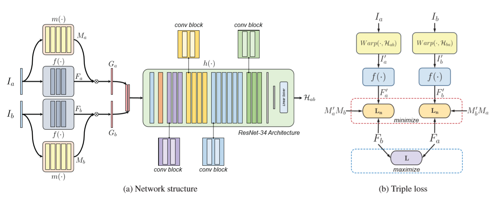


In this work, we propose an unsupervised approach with a new architecture for content awareness learning. In particular, we learn a content mask to reject outlier regions to mimic the traditional RANSAC procedure. To realize this, we introduce a novel triple loss for the effective optimization. Moreover, instead of comparing intensity values directly, we calculate loss with respect to our learned deep features, which is more effective. In addition, we introduce a comprehensive homography dataset, within which the testing set contains manually labeled ground-truth point matches for the purpose of quantitative comparison. The dataset consisted of 5 categories, including regular, low-texture, low-light, small foreground, and large-foreground of scenes. We show the advantages of our method over both traditional feature-based approaches and previous deep-based solutions. 


### Results of Quantitative comparison
 Comparison with previous DNN based methods|  Comparison with feature-based methods
:-------------------------:|:-------------------------:
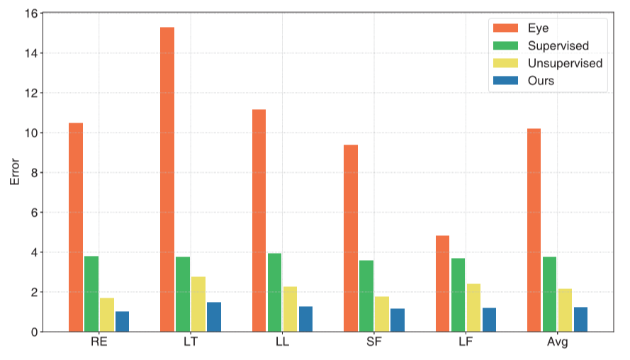  |  


### Results of Qualitative comparison
Input |Ours |SIFT+RANSAC |Unsupervised |Supervised
:-------------------------:|:-------------------------:|:-------------------------:|:-------------------------:|:-------------------------:
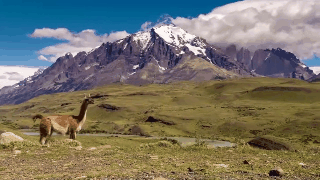  |  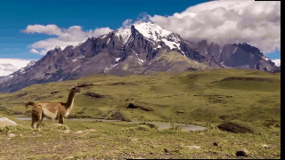  |  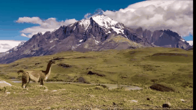  |  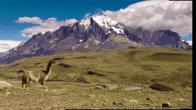  |  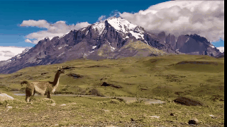
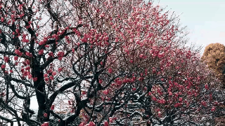  |  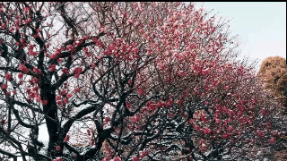  |    |  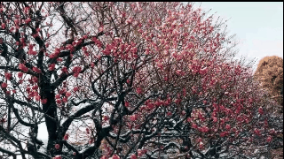  |  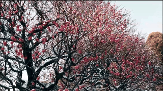
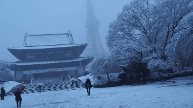  |  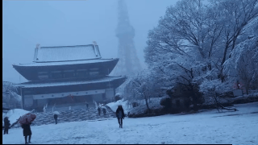  |    |  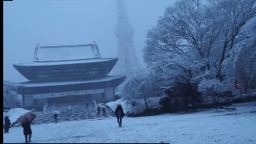  |  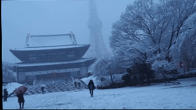
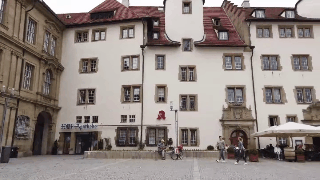  |  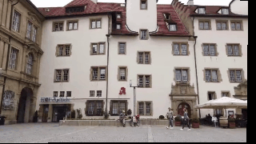  |  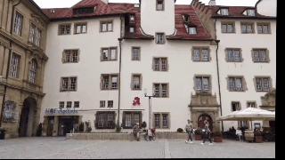  |    |  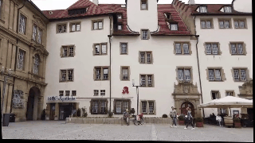
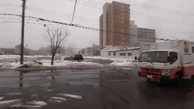  |  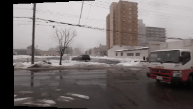  |  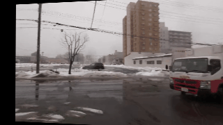  |  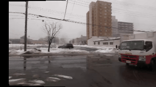  |  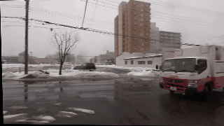
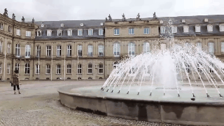  |  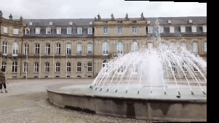  |  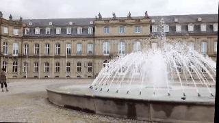  |  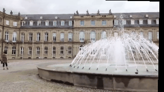  |  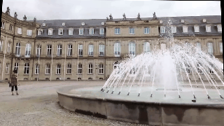
  |    |  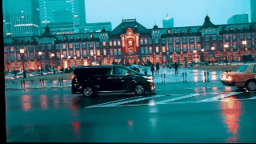  |  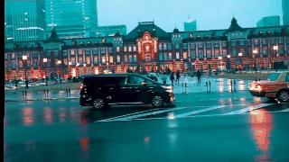  |  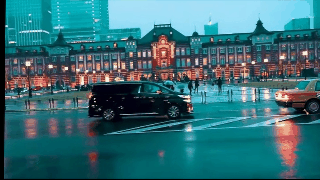
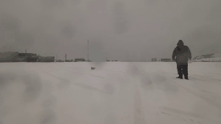  |  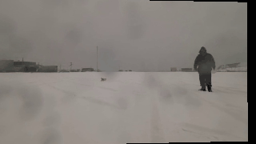  |  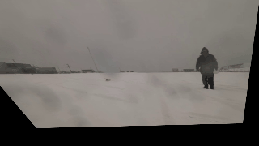  |  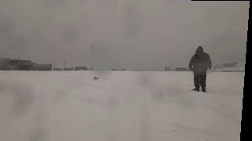  |  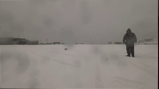
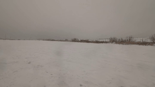  |    |  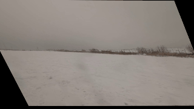  |  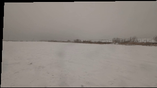  |  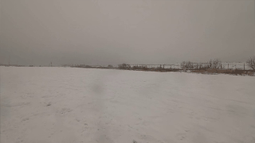
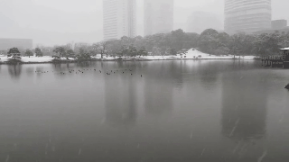  |  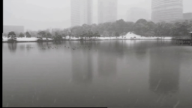  |  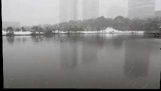  |  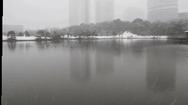  |  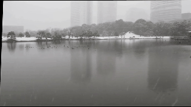
  |    |    |    |  
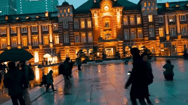  |    |  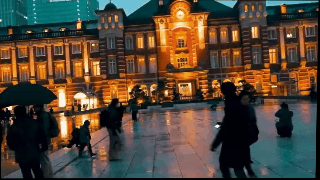  |  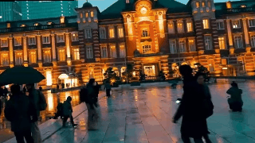  |  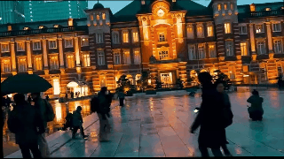
  |    |    |    |  
  |    |    |    |  
  |    |    |    |  
  |    |    |    |  
  |    |    |    |  
  |    |    |    |  


### TODO
1. Data
2. Code
3. Requirements
4. Usage
5. Training


### License and Citation
All code is provided for research purposes only and without any warranty. Any commercial use requires our consent. If you use this code or ideas from the paper for your research, please cite our paper:
```
@article{C-A_DeepH,
author={Jirong Zhang and
               Chuan Wang and
               Shuaicheng Liu and
               Lanpeng Jia and
               Jue Wang and
               Ji Zhou},
title={Content-Aware Unsupervised Deep Homography Estimation},
booktitle={arXiv preprint arXiv:1909.05983},
year={2020}
}
```

### Contact

  Questions can be left as issues in the repository. We will be happy to answer them.
