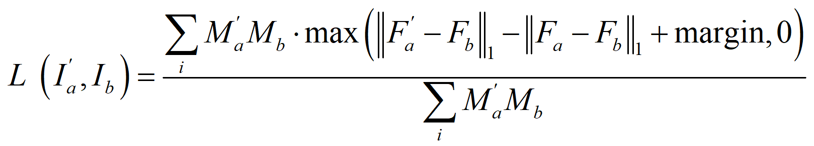

# Content-Aware Unsupervised Deep Homography Estimation [paper](https://arxiv.org/pdf/1909.05983.pdf)
Homography estimation is a basic image alignment method in many applications. It is usually done by extracting and matching sparse feature points, which are error-prone in low-light and low-texture images. On the other hand, previous deep homography approaches use either synthetic images for supervised learning or aerial images for unsupervised learning, both ignoring the importance of handling depth disparities and moving objects in real world applications. To overcome these problems, in this work we propose an unsupervised deep homography method with a new architecture design. In the spirit of the RANSAC procedure in traditional methods, we specifically learn an outlier mask to only select reliable regions for homography estimation. We calculate loss with respect to our learned deep features instead of directly comparing image content as did previously. To achieve the unsupervised training, we also formulate a novel triplet loss customized for our network. We valid our method by conducting comprehensive comparisons on a new dataset that covers a wide range of scenes with varying degrees of difficulties for the task. Experimental results reveal that our method outperforms the state-of-the-art including deep solutions and feature-based solutions.
[introduction](./introduction.md)

## Installation
### Requirements
- Python 3.6
- Pytorch 1.0.1 (1.2.0)
- torchvision 0.2.2
- tensorboardX 1.9

```sh
git clone https://github.com/JirongZhang/DeepHomography.git
cd DeepHomography
```

## Data pre-processing
1. Download raw data
```sh
# GoogleDriver
https://drive.google.com/file/d/19d2ylBUPcMQBb_MNBBGl9rCAS7SU-oGm/view?usp=sharing
# BaiduYun
https://pan.baidu.com/s/1Dkmz4MEzMtBx-T7nG0ORqA (key: gvor)
```
2. Data processing
- Put "models/Coordinate/Train/Test" in the corresponding folder
```sh
python video2img.py
```

## Train
​Our model is designed for small baseline of real data. Here, we provide "Oneline" model which predicts H_ab directly. It also uses triplet loss to optimize the network. It can produce almost comparable performance and much easier to optimize. So, we use this version for now.   Thanks to [@Daniel](https://github.com/dkoguciuk) for the accurate loss function. The formula can be simplified as:  
<div align=center></div>

1. Oneline train from scrach
```sh
python train.py --gpus 2 --cpus 8 --lr 0.0001 --batch_size 32
```
2. Oneline two-stage version

Please set the mask to all ones at the begining using (details in line 277-281 of resnet.py). 
```sh
python train.py --gpus 2 --cpus 8 --lr 0.0001 --batch_size 32
```
With stable features have been trained from the feature extractor, i.e. At least 2 epochs, then finetuned the network with mask predictor involved, with a small learning rate. 
```sh
python train.py --gpus 2 --cpus 8 --lr 0.000064 --batch_size 32 --finetune True
```
If you want to try "Doubleline" version, please add another half of the loss and using getBatchHLoss() which in *utils.py* to add H loss. If you have any questions, please contact us. 

## Test
```sh
python test.py
```

## Release History

* **2020.8.4**
    * Sorry for waiting. We have uploaded codes and dataset. Please read our [final version of paper](https://arxiv.org/pdf/1909.05983.pdf), which complements more discussion.
* **2020.7.3**
    * Our paper has been accepted by ECCV2020 as oral presentation.
* **2019.11.22**
    * We will upload the codes&model after this paper has been accepted.
*  **2019.9.12**
    * Repository for ["Content-Aware Unsupervised Deep Homography Estimation"](https://arxiv.org/pdf/1909.05983.pdf).

## Meta

ZHANG Jirong – zhangjirong.dgt@gmail.com or zhangjirong@std.uestc.edu.cn 

All code is provided for research purposes only and without any warranty. Any commercial use requires our consent. If you use this code or ideas from the paper for your research, please cite our paper:
```
@article{zhang2019content,
  title={Content-Aware Unsupervised Deep Homography Estimation},
  author={Zhang, Jirong and Wang, Chuan and Liu, Shuaicheng and Jia, Lanpeng and Wang, Jue and Zhou, Ji},
  journal={arXiv preprint arXiv:1909.05983},
  year={2019}
}
```

## References
  [1] T. Nguyen, S. W. Chen, S. S. Shivakumar, C. J. Taylor, and V. Kumar. Unsupervised deep homography: A fast and robust homography estimation model. IEEE Robotics and Automation Letters, 3(3):2346–2353, 2018  
  [2] D. DeTone, T. Malisiewicz, and A. Rabinovich. Deep image homography estimation. arXiv preprint arXiv:1606.03798, 2016

