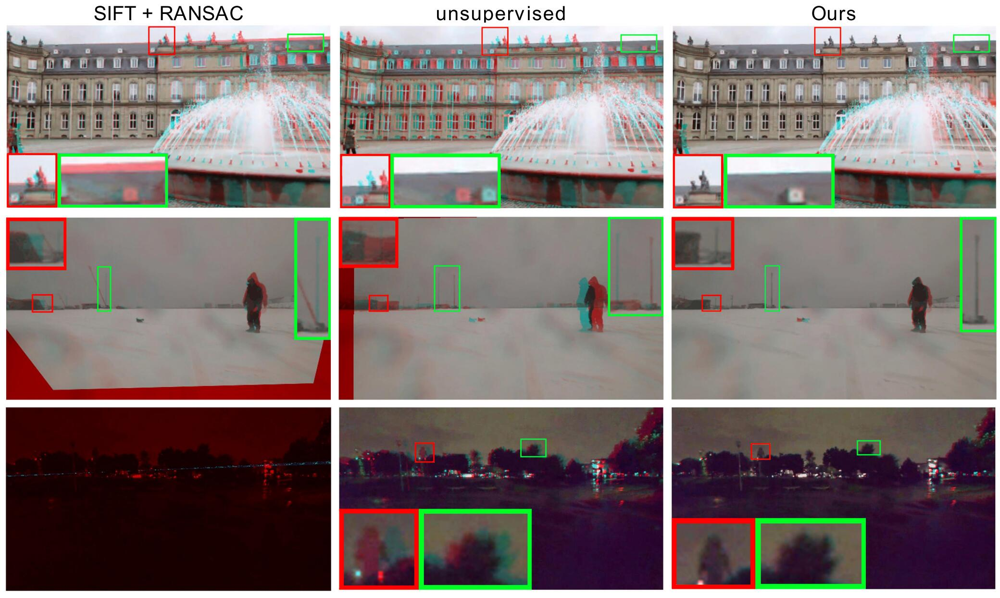
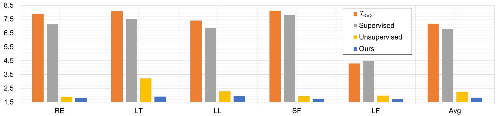

### Introduction

Homography estimation is a basic image alignment method in many applications. It is usually done by extracting and matching sparse feature points, which are error-prone in low-light and low-texture images. On the other hand, previous deep homography approaches use either synthetic images for supervised learning or aerial images for unsupervised learning, both ignoring the importance of handling depth disparities and moving objects in real world applications. To overcome these problems, in this work we propose an unsupervised deep homography method with a new architecture design. In the spirit of the RANSAC procedure in traditional methods, we specifically learn an outlier mask to only select reliable regions for homography estimation. We calculate loss with respect to our learned deep features instead of directly comparing image content as did previously. To achieve the unsupervised training, we also formulate a novel triplet loss customized for our network. We valid our method by conducting comprehensive comparisons on a new dataset that covers a wide range of scenes with varying degrees of difficulties for the task. Experimental results reveal that our method outperforms the state-of-the-art including deep solutions and feature-based solutions.

This repository contains the required models and scripts for the paper  ["Content-Aware Unsupervised Deep Homography Estimation"](https://arxiv.org/pdf/1909.05983.pdf).

### Results of Quantitative comparison
| Comparison with previous DNN based methods|
|:-------------------------:|
|  |

| Comparison with feature-based methods |
| :-----------------------------------: |
|                 |

### Results of Qualitative comparison
Input |Ours |SIFT+RANSAC |Unsupervised[1] |Supervised[2]
:-------------------------:|:-------------------------:|:-------------------------:|:-------------------------:|:-------------------------:
  |    |    |    |  
  |    |    |    |  
  |    |    |    |  
  |    |    |    |  
  |    |    |    |  
  |    |    |    |  
  |    |    |    |  
  |    |    |    |  
  |    |    |    |  
  |    |    |    |  
  |    |    |    |  
  |    |    |    |  
  |    |    |    |  
  |    |    |    |  
  |    |    |    |  
  |    |    |    |  
  |    |    |    |  
  |    |    |    |  
